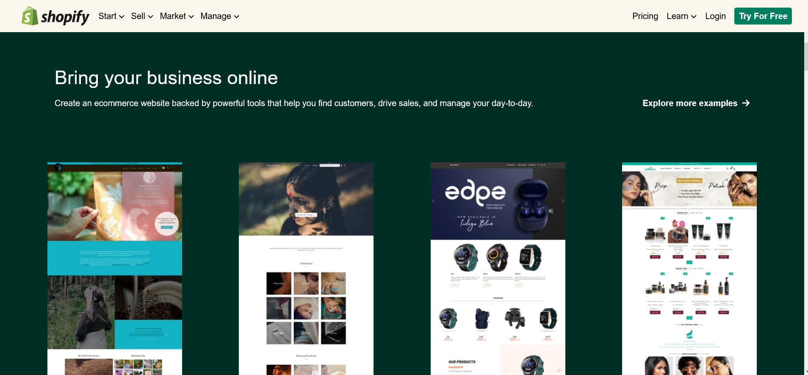

# Live_Class_Project17 -

This assignment was given as a task in [ineuron's](https://ineuron.ai/course/Full-Stack-JavaScript-Bootcamp-2.0) full stack javascript bootcamp by Hitesh Choudhary sir.

- This assignment is to replicate the landing page of [Shopify](https://www.shopify.com/in) and was supposed to be done using Tailwind CSS or Bootstrap.

- This project took around 4 hrs to complete.

## Tool/Technologies used -

- **Html**
- **Css**
- **Tailwind CSS**
- **Github**

&nbsp;

   

# Preview of the project-

## Large screen preview-

## Medium/small screen preview-

## Mobile screen preview-

**Learnings** - I had a thorough understanding about Tailwind Css methodologies and classes :

> **container**, **flex-direction** , **flex-basis** , **align-items**, **justify-content**,**hover**, **padding**, **margin**, **align-content** and different Tailwind css styles and properties
